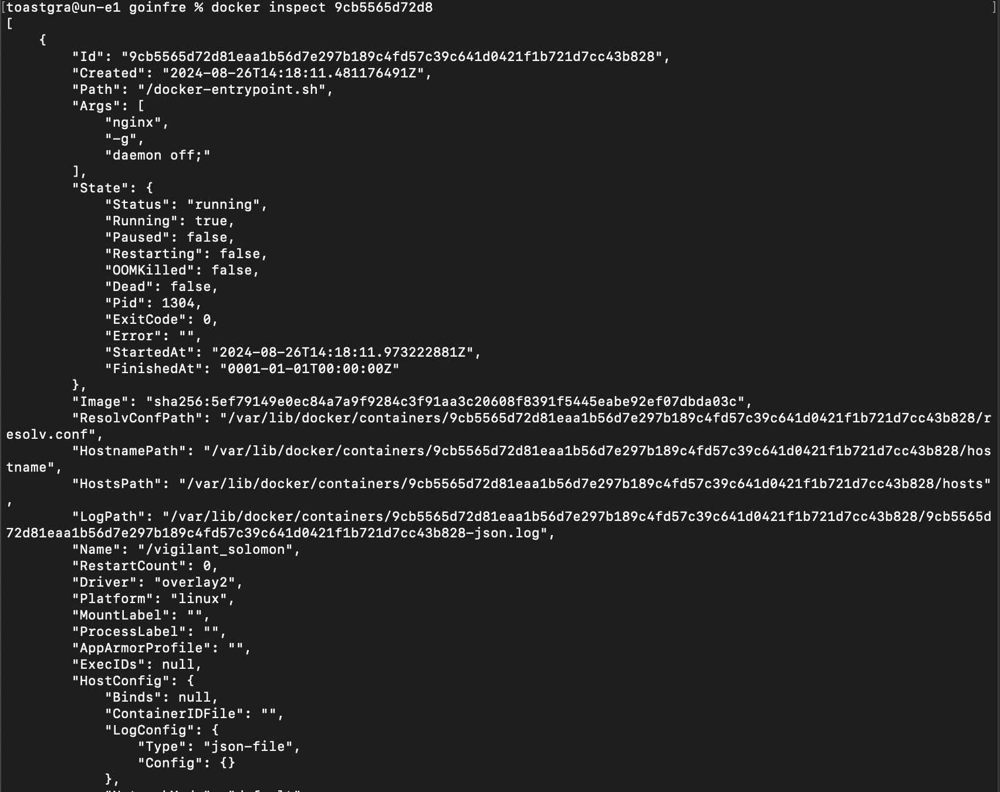

## Part 1. Готовый докер

- ### Возьмём официальный докер-образ с **nginx** и выкачаем его при помощи `docker pull`.

- ### Проверим наличие докер-образа через `docker images`.

- ### Запустим докер-образ через `docker run -d [image_id|repository]`.

- ### Проверим, что образ запустился через `docker ps`.

- ### Посмотрим информацию о контейнере через `docker inspect [container_id|container_name]`.

- ### По выводу команды определим размер контейнера:

- ### список замапленных портов:

- ### ip контейнера:

- ### Остановим докер образ через `docker stop [container_id|container_name]`.

- ### Проверим, что образ остановился через `docker ps`.

- ### Запустим докер с портами 80 и 443 в контейнере, замапленными на такие же порты на локальной машине, через команду *run*.

- ### Проверяем, что в браузере по адресу *localhost:80* доступна стартовая страница **nginx**.

- ### Перезапустим докер контейнер через `docker restart [container_id|container_name]`. Проверим, что контейнер запустился.

## Part 2. Операции с контейнером

- ### Прочитем конфигурационный файл *nginx.conf* внутри докер контейнера через команду *exec*.

- ### Создаем на локальной машине файл *nginx.conf*.

- ### Настраиваем в нем по пути */status* отдачу страницы статуса сервера **nginx**.

- ### Скопируй созданный файл *nginx.conf* внутрь докер-образа через команду `docker cp`.

- ### Перезапустим **nginx** внутри докер-образа через команду *exec*.

- ### Проверим, что по адресу *localhost:80/status* отдается страничка со статусом сервера **nginx**.

- ### Экспортируем контейнер в файл *container.tar* через команду *export*.

- ### Останавливаем контейнер.

- ### Удаляем образ через `docker rmi [image_id|repository]`, не удаляя перед этим контейнеры.

- ### Удаляем остановленный контейнер.

- ### Импортируем контейнер обратно через команду *import*.

- ### Запускаем импортированный контейнер.

- ### Проверяем, что по адресу *localhost:80/status* отдается страничка со статусом сервера **nginx**.

## Part 3. Мини веб-сервер

- ### Пишем мини-сервер на **C** и **FastCgi**, который будет возвращать простейшую страничку с надписью `Hello World!`.

- ### Пишем свой *nginx.conf*, который будет проксировать все запросы с 81 порта на *127.0.0.1:8080*.

 - ### Устанавливаем fcgi
`brew install fcgi`

 - ### Запускаем докер
`docker run -d -p 81:81 nginx`

<!-- `[перезапустить контейнер]` -->
 - ### Копируем файлы 
`docker cp nginx.conf [container_id|container_name]:/etc/nginx`\
`docker cp hello.c [container_id|container_name]:/home `

 - ### Запускаем интерактивную сессию bash внутри контейнера
`docker exec -it [container_id|container_name] bash`
 - ### Устанавливаем gcc, spawn-fcgi, libfcgi-dev
`apt-get update `\
`apt-get install -y gcc spawn-fcgi libfcgi-dev`

 - ### Компилируем
`gcc -o hello hello.c -lfcgi`
- ### Запускаем написанный мини-сервер через *spawn-fcgi* на порту 8080.
`spawn-fcgi -p 8080 ./hello`

- ### Проверяем, что в браузере по *localhost:81* отдается написанная страничка.

## Part 4. Свой докер

- ### Пишем свой докер образ

- ### Собираем написанный докер образ через docker build, при этом указав имя и тег

- ### Проверяем через docker images, что все собралось корректно

- ### Запускаем собранный докер образ с маппингом 81 порта на 80 на локальной машине и маппингом папки ./nginx внутрь контейнера по адресу, где лежат конфигурационные файлы nginx'а
`docker run -it -p 80:81 -v "$(pwd)/nginx.conf:/etc/nginx/nginx.conf" -d hello:s21 bash`

- ### Проверяем, что по localhost:80 доступна страничка написанного мини сервера

- ### Дописываем в ./nginx/nginx.conf проксирование странички /status, по которой надо отдавать статус сервера nginx

- ### Перезапускаем контейнер
`docker restart [container_id|container_name]`
- ### Проверяем, что теперь по localhost:80/status отдается страничка со статусом nginx

## Part 5. **Dockle**

- ### Запускаем контейнера, остановка и удаление образа
`docker start [container_id|container_name]`\
`docker stop [container id/name]`\
`docker rmi -f hello:s21`
- ### Устанавливаем dockle
`brew install goodwithtech/r/dockle`
- ### Создание образа и экспортирование его в .tar
`docker build -t hello:s21 .`\
`docker save hello:s21 -o hello.tar`
- ### Сканируем образ из предыдущего задания через `dockle [image_id|repository]`.
`dockle --input hello.tar `

- ### Исправляем образ так, чтобы при проверке через **dockle** не было ошибок и предупреждений.

## Part 6. Базовый **Docker Compose**

- ### Пишем файл *docker-compose.yml*, который:
  - ### 1) Поднимает докер-контейнер из [Части 5]
  - ### 2) Поднимает докер-контейнер с **nginx**, который будет проксировать все запросы с 8080 порта на 81 порт первого контейнера.

- ### Замапим 8080 порт второго контейнера на 80 порт локальной машины.

- ### Остановим все запущенные контейнеры.
`docker stop [container id/name]`
- ### Собираем и запускаем проект с помощью команд `docker-compose build` и `docker-compose up`.
`docker compose build `   

`docker compose up `

`docker compose down`

- ### Проверяем, что в браузере по *localhost:80* отдается написанная страничка, как и ранее.

